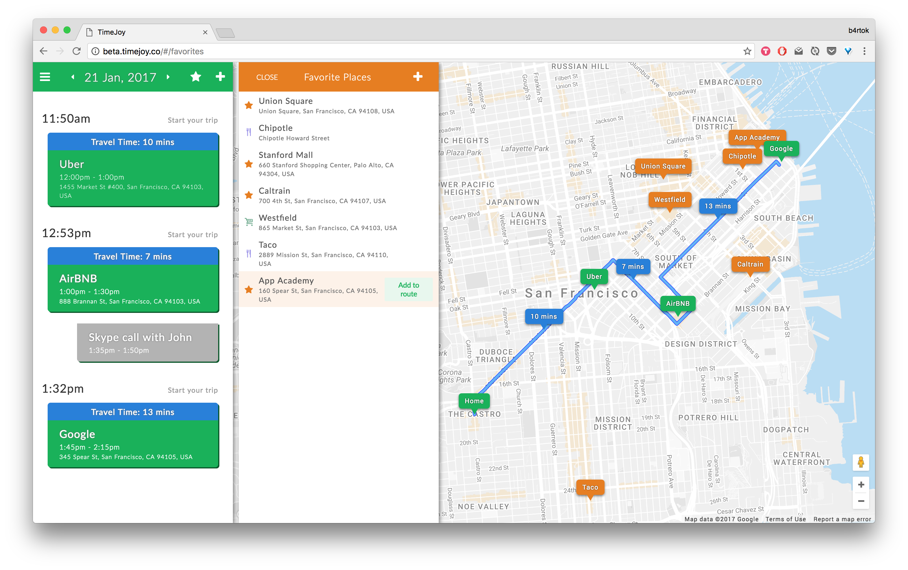
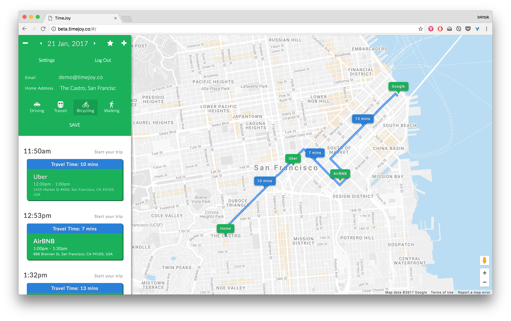
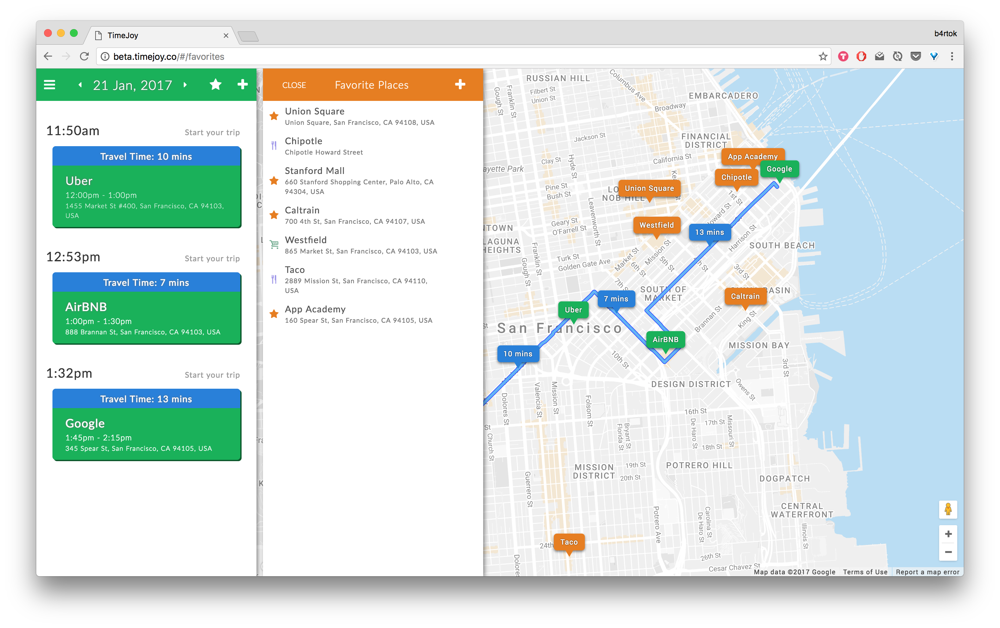

# TimeJoy

[Live Demo][timejoy]

[timejoy]: http://beta.timejoy.co/


_Integrates your calendar and map apps so you know exactly when and where you need to be._

TimeJoy analyzes user events for selected day, detect events with the valid address and build a route for a day. It calculates travel time based on user default travel mode, display directions on the map. Users also could save favorite places by different categories and add them to the route and TimeJoy will adjust your directions accordingly.




## Features & Implementation

### Calendar Events
#### Calendar Tab display events based on selected day.
To archive this I keep track of selectedDay in Store and user can navigate to previous or next day and events will be fetched in interval between `beginnig_of_selected_day` and `end_of_selected_day`.

To manipulate with data and time on front-end I use `moment.js` and `moment-timezone.js` to grab user timezone and store it in User model.

#### Build a route for the day
The most important feature of the app is calculating route for the day.
It should starts from home and then calculate travel time and directions between all events with correct location.

To archive this I use `Geocoder gem` and modified by me `Google-service-api gem`.

The challenges were:
  - How to properly detect `begginig_of_the_day` and `end_of_the_day` based on User Timezone, to detect what event is first on the day and which is last.
  - How wo properly reflect to changes if event was created, deleted, address or time was changed.
  - Do as minimum API request as possible, because free daily limit is low.

To archive this I created `Directions` model with relationship: `Event has one Directions`.

And general logic based around Active Record Callbacks:

Event
```
before_create :ensure_updated_address
after_create :include_in_route, if: :formatted_address_present?

before_update :update_address, if: :address_changed?
after_update :handle_update

after_destroy :analyze_next_event, if: :formatted_address_present?
```

Directions
```
after_initialize :request_directions_from_google,
                   unless: :encoded_polyline_present?
```

### User Settings



The main User Settings are:
  - Timezone: grab with `moment-timezone.js` on signup
  - Default Travel Mode: User can change and directions will be recalculated for all future events.
  - Home Address: If exist, directions to first event on the day will be calculated from this address. On change, all future events will be recalculated if necessary.

User
```
after_update :recalculate_future_calendar_events,
             if: "home_address_changed? || default_travel_mode_changed?"
```
### Google Maps Integration

To implement Google Map integration I decided to do it from scratch, because none of existing React libraries-wrappers for Google Maps don't support my needs:
  - Display Custom Designed Markers with reach html
  - Display directions from encoded polyline

I wrap Google Maps Map object inside Map Component and Map Container.
Inside this components I Have EventMarker, FavoritePlaceMarker and Directions react components. Manipulating by component lifecycle methods I create/update/delete my custom markers or polylines. It uses the power of React Virtual Dom and help us to easily map any integration inside React to external api.
```
<EventMarker
  key={ idx }
  map={ map }
  event={ event }
  onHoverIn={ this.handleEventHoverIn.bind(this, event.id) }
  onHoverOut={ this.handleEventHoverOut.bind(this, event.id) }
  onClick={ this.handleEventMarkerClick }
  />
```
Custom Markers based on `google.maps.OverlayView`.

### Favorite Places



User car create, update and delete favorites places.
He also can easily add Favorite Place to route and directions will be recalculated.
User can orginize places by categories, preview them on map and address field uses all power of Google Places Autocomplete.

## Future Directions for the Project

- Integration with Google Calendar
- Make smooth animations on Google Maps
- Smart Favorite places based on Google Places, Foursquare, Yelp, TripAdvisor APIs
- Parking Options around event location (parking apps APIs)
